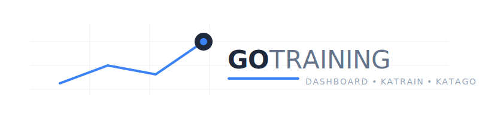

<div align="center">



[English](README.md) | 中文

</div>

一个基于 [KaTrain](https://github.com/sanderland/katrain) 的个人围棋训练仪表盘。读取 KaTrain 导出的 SGF 棋谱，解析其中的 KataGo 分析数据，以可交互的 Web 界面展示你的布局阶段训练进展。

| 总览 | 对局历史 |
|:---:|:---:|
|  |  |

## ✨ 功能特性

- 📊 每局统计：平均失分、波动范围、最佳手比例、策略排名
- 📈 长期进步趋势图
- 🎯 落子质量分布直方图（KaTrain 六档评级）
- 🔍 每局详情：交互式棋盘、形势/胜率走势、布局/中盘/官子阶段分析、悔棋记录
- ⚡ WebSocket 实时推送——把新棋谱扔进 `training/`，仪表盘自动刷新，无需重启
- 🌐 中英文界面随时切换
- 💡 每项关键指标都有说明提示，悬停或点击查看

## 🧰 环境要求

- [Docker Desktop](https://www.docker.com/products/docker-desktop/)（Mac、Windows、Linux 均可）

仅此而已，无需在本机安装 Python 或 Node.js。

## 🚀 快速开始

### 1. 克隆仓库

```bash
git clone https://github.com/your-username/go-training.git
cd go-training
```

### 2. 创建棋谱文件夹

棋谱属于个人数据，不纳入版本管理。先建好目录：

```bash
mkdir -p training
```

把你的 KaTrain SGF 棋谱复制进去，启动后会自动加载，运行中也会持续监测新文件。

### 3. 启动仪表盘

```bash
docker compose up --build
```

首次构建约需 30–60 秒（下载 Python 基础镜像并安装依赖），之后启动很快。

浏览器打开 [http://localhost:4096](http://localhost:4096) 即可。

## 🎮 日常使用

配置好之后，日常启停只需两条命令：

```bash
# 后台启动
docker compose up -d

# 停止
docker compose down
```

下完棋后照常从 KaTrain 保存棋谱，仪表盘会在几秒内自动更新，不用重启。

## 🗂 项目结构

```
go-training/
├── training/               # 你的棋谱文件（已 gitignore）
├── docker-compose.yml      # 服务定义与资源限制
├── Dockerfile              # Python 3.12 slim 镜像
├── requirements.txt        # FastAPI、uvicorn、watchfiles、pydantic
└── app/
    ├── main.py             # FastAPI 应用，REST API + WebSocket 端点
    ├── models.py           # Pydantic 响应模型
    ├── sgf_parser.py       # 来自 KaTrain 的 SGF 解析器（vendored）
    ├── comment_parser.py   # 解析棋谱注释中的 KataGo 分析数据
    ├── stats_engine.py     # 每局统计计算
    ├── sgf_service.py      # 解析流程编排
    ├── game_cache.py       # 内存缓存（基于 mtime 失效）
    ├── file_watcher.py     # 异步文件监测 + WebSocket 推送
    └── static/
        ├── index.html      # Vue 3 单页应用（无需构建）
        ├── js/
        │   ├── app.js      # Vue 应用 + Chart.js 图表
        │   └── i18n.js     # 中英文翻译
        ├── css/
        │   └── style.css
        └── img/            # KaTrain 棋盘图片（MIT 许可，已内置）
```

## ⚙️ 资源占用

容器资源限制已在 `docker-compose.yml` 中配置：

| 资源 | 上限 | 实际用量 |
|---|---|---|
| 内存 | 128 MB | 约 40 MB |
| CPU | 0.5 核 | 空闲时 < 1% |

## 🔌 API 接口

后端提供以下 JSON 接口，方便自行扩展：

| 接口 | 说明 |
|---|---|
| `GET /api/games` | 所有对局列表及摘要统计 |
| `GET /api/stats` | 全局趋势聚合数据 |
| `GET /api/game/{filename}` | 单局完整详情（走势、落子坐标、悔棋记录） |
| `WS /ws` | WebSocket——棋谱文件变动时推送 `{"type":"update"}` |

## 📝 注意事项

- 仅支持含有 KataGo 分析注释的 KaTrain 棋谱；普通 SGF 文件可以解析，但不会显示统计数据。
- 本仪表盘专为布局训练设计（对局在第 50 手结束），阶段分析和策略排名在此场景下最有参考价值。
- 棋谱文件已 gitignore，属于个人数据。

## 🤝 参与贡献

这个项目是纯 vibe coding 的产物，作为私人工具维护，不接受 PR。如果你想在此基础上做改动，欢迎直接 fork——鼓励大家发展出自己的版本。

## 📄 许可证

MIT © 2026 Yuhuang Hu

本项目在 `app/sgf_parser.py` 中引用了 [KaTrain](https://github.com/sanderland/katrain) 的部分代码（MIT 许可，© 2020 Sander Land）。
